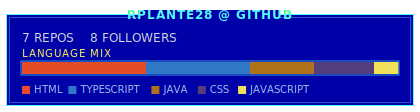
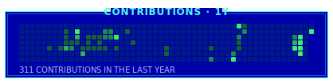
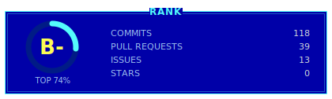

## Rohan Plante

Computer Science student at Marist University. I build real, working systems:
a voice-enabled campus navigator, a scalar-pipelined 6502 CPU emulator, and
full-stack apps. Open to software and data internships.

[rohanplante.com](https://www.rohanplante.com) &nbsp;·&nbsp; [LinkedIn](https://linkedin.com/in/rohan-plante) &nbsp;·&nbsp; rohanplante@gmail.com

<!--STATS_START-->

<!--STATS_END-->

Contribution timeline and rank

 

### Projects

- **[MaristMaps](https://github.com/RPlante28/maristmaps)** &nbsp; Campus navigation with a voice-enabled AI agent and multi-floor indoor routing. Best Overall, Marist Spring 2026 hackathon.
- **[6502 Emulator](https://github.com/RPlante28/6502-emulator)** &nbsp; A scalar-pipelined MOS 6502 CPU with hazard handling and performance stats.
- **[ROHAN-DOS Portfolio](https://www.rohanplante.com)** &nbsp; A DOS-style portfolio that boots and runs the live 6502 emulator.
- **[Randomized Tiered Chests](https://github.com/RPlante28/Randomized_Tiered_Chests)** &nbsp; A Minecraft event plugin that auto-tiers loot chests.
